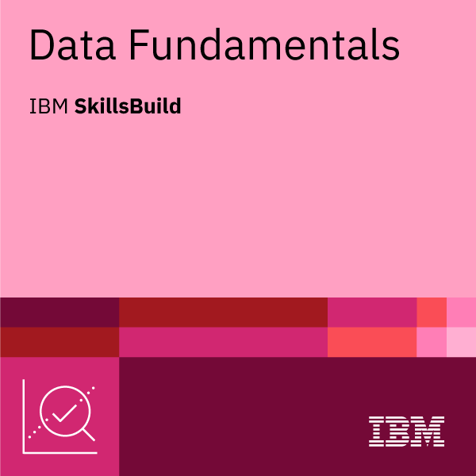

Hi, I'm Frank Chika (nwajiakuchika)

Data Analyst | IBM Certified Data Fundamentals Specialist | Delta, Nigeria

### Certification

**IBM Data Fundamentals - Specialist V2**
- Issued by IBM SkillsBuild — Sep 2026 
- Skills: Data Literacy, Data Analysis, Data Visualization, SQL & Databases
- Verify my badge: [Credly Verification Link](PASTE-YOUR-LINK-HERE)

### 🛠️ Tech Stack
Python | SQL | Excel | Data Visualization | GitHub

### 📫 Open to Work
Available for freelance data projects on upwork - Let's work together!
